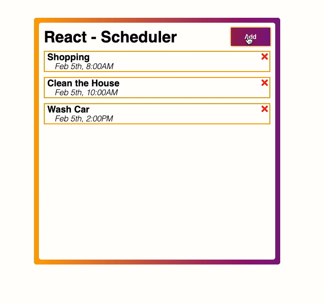

# scheduler-react

## Table of Contents
* [General Info](#general-info)
* [Technologies](#technologies)
* [Setup](#setup)

## General info
A simple scheduler app create with React. Project will consist of front-end and back-end (Node.JS / Express.JS).
Initial repository was corrupted in some fashion and not displaying code properly, so code transfer to this one removed stage/commit history.


<!--  -->

## Technologies
Project is created with:
* React : ^17.0.1
* React-Dom: ^17.0.1
* NPM: 6.14.4
* Node: 12.16.3

## Setup
To run this project, install it locally using npm:

```
$ cd ../reactscheduler
$ npm install
$ npm start
```
